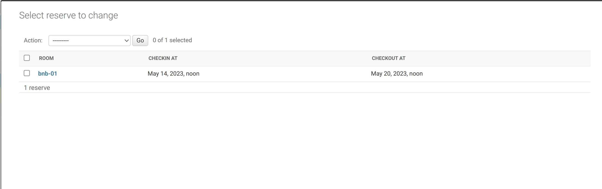
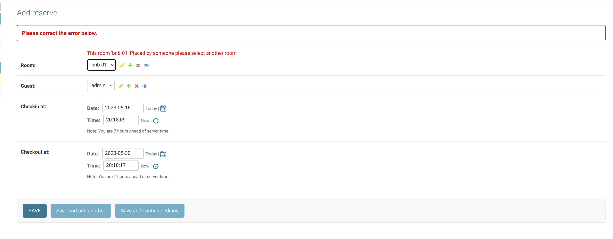
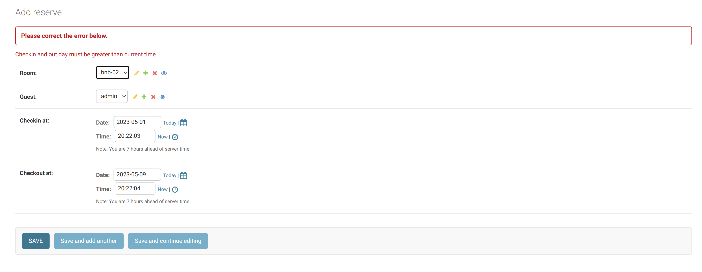
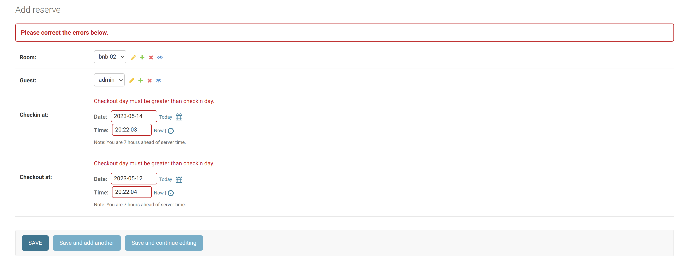
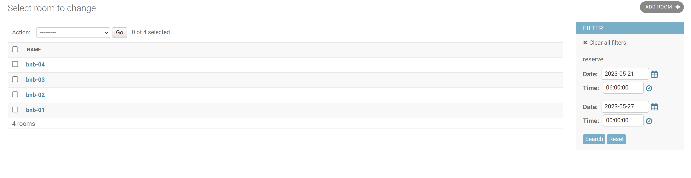
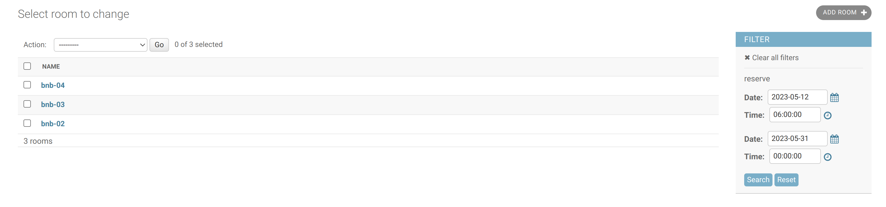

---
### Dev.
#### Install tool.
```shell
pip install poetry
```

#### Install depends.
```shell
poetry install
```

#### Start dev env.
```shell
poetry shell
```

#### Start dev env.
```shell
python manage.py runserver
```

#### Manual test.
Navigate to [http://localhost:8000/admin/](http://localhost:8000/admin/) with credential `admin | admin123`

## Test reserve and room.

## Reserve.
Simple demo by Admin built-in.


#### Check overlap.


#### Validation in/out.



## Available Room's filter by datetime range.

| ROOM | CHECKIN | CHECKOUT |
|------|---------|----------|
|   bnb-01   |    May 27, 2023, 8:18 p.m.     |    May 30, 2023, 8:18 p.m.      |
|    bnb-01  |   May 14, 2023, 6 a.m.      |    May 20, 2023, 6 a.m.      |

#### Gap between: 20-27 on May.


#### Full range from 12-31 May.
